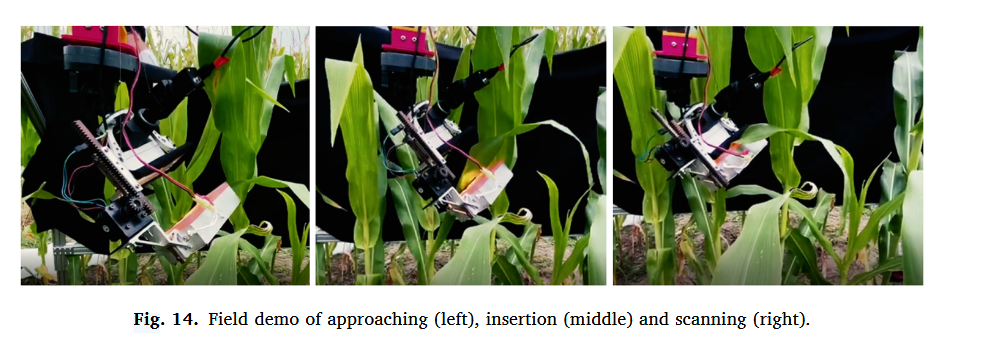
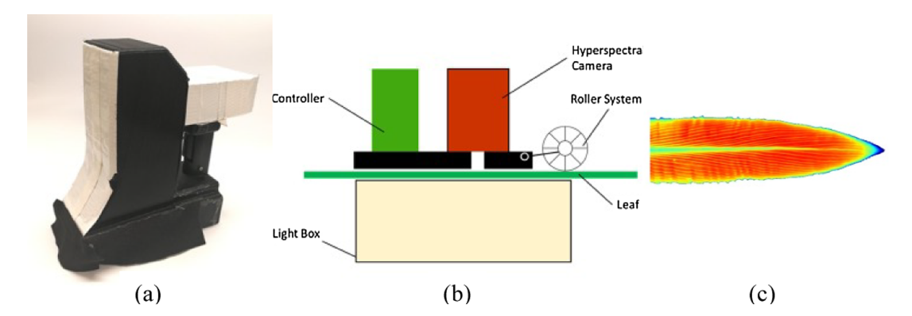

# Automated in-field leaf-level hyperspectral imaging of corn plants using a Cartesian robotic platform

[文章链接](paper.pdf)

> Automated in-field leaf-level hyperspectral imaging of corn plants using a Cartesian robotic platform. Elsevier,
> Computers and Electronics in Agriculture

> Purdue University, West Lafayette, IN, USA and Zhejiang University, Hangzhou, China

## 摘要

为了采集叶片的高光谱数据，2018年，普度大学的工程师开发了一款手持式的仪器LeafSpec来解决之前的叶片高光谱传感器只能检测一点，检测信息无法很好的代表整个叶片
或冠层。 这篇文章构建了一个机器人系统来代替人类去使用LeafSpec，以此来解决人类操作的不稳定性和不准确性。

## 工作原理

工作原理是通过机器人的运动来实现叶片的高光谱数据采集。机器人的运动是通过一个笛卡尔坐标系来控制的，
这样可以保证机器人的运动是平滑的，而不是突然的。

## 工作优缺点
总体来说，工作有些粗糙，相关性不大。

## 词汇积累

Handheld leaf **spectrometers** provide a higher quality of spectral data, but they only **measure a small spot** on the leaf,
**which cannot represent** the whole leaf or canopy **very well due to the great variation between different locations**