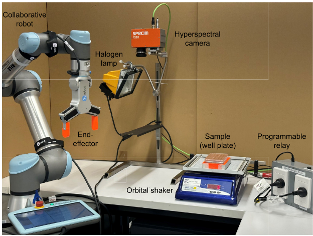
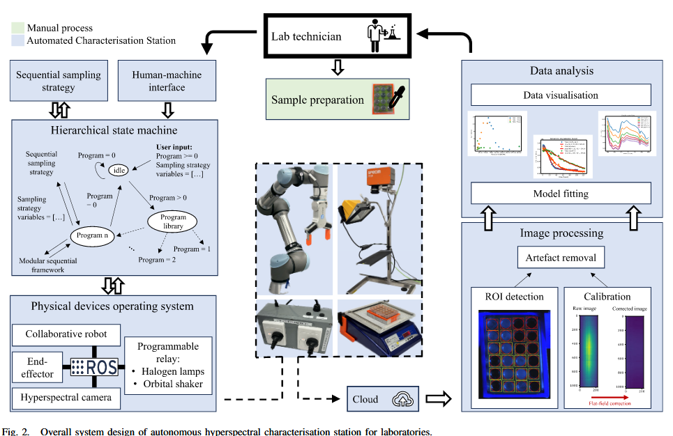
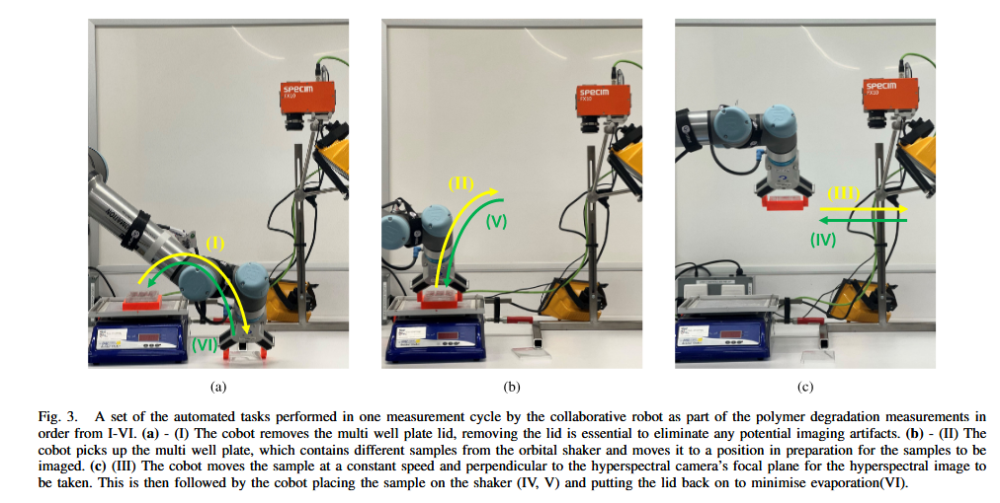

# Autonomous Hyperspectral Characterisation Station:  Robot Aided Measuring of Polymer Degradation

> Azizi, Shayan, et al. ["Autonomous Hyperspectral Characterisation Station: Robot Aided Measuring of Polymer
> Degradation."](../../../assets/Autonomous_Hyperspectral_Characterisation_Station_Robot_Aided_Measuring_of_Polymer_Degradation.pdf) IEEE Transactions on Automation Science and Engineering (2024).

## 摘要

该文章创建了一种自动化高光谱特性测量站 (automated hyperspectral characterisation station)，用于测量聚合物的降解率（polymer
degradation rates）。
该系统由一个机器人和一个高光谱成像系统组成。机器人负责将样品放置在高光谱成像系统下，然后将样品移动到下一个位置。
高光谱成像系统负责采集样品的高光谱图像。该系统的目的是提高高光谱成像系统的效率，减少人工操作的时间。

This station integrates robot-aided hyperspectral imaging (HSI), complex material characterisation modelling, and
automated data analysis, offering a non-destructive and comprehensive approach.

我们只关注其中的机器人及数据采集部分。

## 工作原理

操控机器人抓取样品并缓慢带动其通过高光谱检测区域，获得图像数据，同时在后续的数据处理中，利用opencv的圆检测，来选择ROI区域，以提高数据处理的效率。

## 工作优缺点
缺点： 机械臂的作用有限，只是提供了一个相对运动的平台。并没有发挥机器人应有的作用。

## 词汇积累

- Apparatus and Integration: 设备和集成
- Traceability, accuracy and efficiency: 可追溯性， 准确性和效率
- objective, data-driven and quantifiable: 客观，数据驱动和可量化      