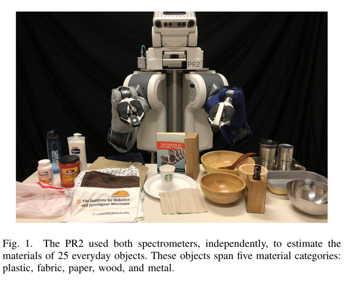

# Classification of Household Materials via Spectroscopy

文章链接：[Classification of Household Materials via Spectroscopy](paper.pdf)

## 摘要

通过两种不同的商业光谱仪，我们对超过50种家庭物品进行了光谱分析，以确定它们的材料。我们的实验结果表明，光谱学是一种有前途的方法，可以帮助机器人在操作过程中对物体进行材料分类。

并通过交叉验证实现了79.1%的准确率，这表明光谱学是一种可靠且有效的方法，可以帮助机器人推断日常家用物品的材料属性.

## 工作原理

## 工作优缺点
物体的种类过于多且杂乱，没有考虑颜色影响，没有考虑材料的子类别。

## 词汇积累

1. From this work, we find that spectroscopy **poses a promising approach for material classification** during robotic
   manipulation.
2. In this work, we presented how robots can **leverage spectral data** to infer the materials of objects.
3. Through this work, **we have demonstrated that spectroscopy presents a reliable and effective way** for robots to infer
   the material properties of everyday household objects.
4. The materials that form an object have important implications as robots interact with people and manipulate objects
   in real-world environments.
5. This rotation helped add variation to the dataset and prevented the spectrometers from continually taking
   measurements of the same location on an object.

## 后续工作
[multimodal-material-classification-for-robots](../Multimodal%20Material%20Classification%20for%20Robots/Multimodal%20Material%20Classification%20for%20Robots.md)