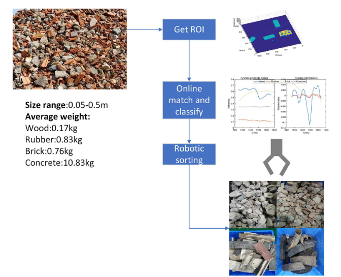
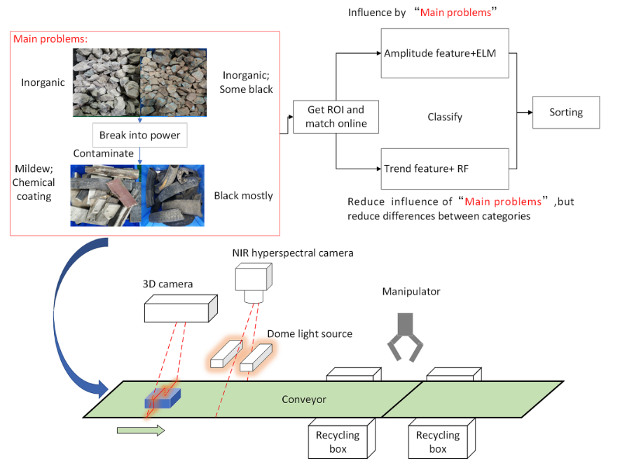

# Development of an automatic sorting robot
> Xiao, Wen, et al. "Development of an automatic sorting robot for construction and demolition waste." 
> Clean Technologies and Environmental Policy 22 (2020): 1829-1841.

文章链接：[Development of an automatic sorting robot for construction and demolition waste](paper.pdf)

## 摘要
该系统集成了近红外（NIR）高光谱成像和高度图检测，用于根据材料的光谱特征进行分类。
通过高度图来进行roi划分，因为rgb图像在覆盖灰尘的情况下会受到影响，而高度图不会。

## 工作原理

引入Trend feature来对材料进行分类。这个特征就是光谱曲线一阶导数

## 工作优缺点

