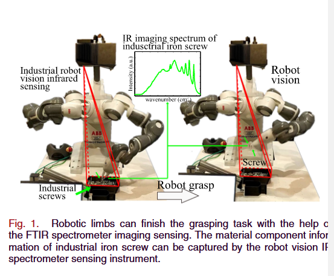

# Flexible FTIR Spectral Imaging Enhancement for  Industrial Robot Infrared Vision Sensing

> Liu, Tingting, et al. "Flexible FTIR spectral imaging enhancement for industrial robot infrared vision sensing." IEEE
> Transactions on Industrial Informatics 16.1 (2019): 544-554.

> Carnegie Mellon University,City University of Hong Kong, Kowloon, Hong Kong,
 IEEE Transactions on Industrial Informatics 16.1 (2019) [文章链接](paper.pdf)

## 摘要
这篇文章提出了一种新的方法，用于提高工业机器人的红外视觉传感器的性能。这种方法使用了FTIR光谱成像技术，可以捕获物质的组分信息，
这些信息可以用于辅助设置抓取控制参数。开发了一种基于全变差（TV）约束的分辨率增强算法，用于抑制噪声并分离重叠的光谱带。
## 工作原理

## 工作优缺点

## 词汇积累

However, the FTIR spectrometer sensing can capture the material component information, which can be used for assisting
the setting of **grasping control parameters**

The FTIR imaging spectrum recognition provides rich material information for industrial robot vision sensing.