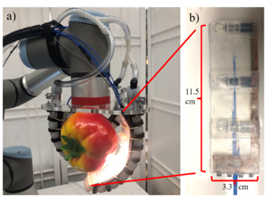
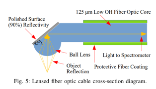

# In-Hand Object Recognition with Innervated Fiber Optic Spectroscopy for Soft Grippers

> Nathaniel Hanson1, Hillel Hochsz , Northeast University, Boston, MA, USA

文章链接：[In-Hand Object Recognition with Innervated Fiber Optic Spectroscopy for Soft Grippers](paper.pdf)

## 摘要

文章提出了一种基于光纤光谱学的软抓取器中的手持物体识别方法。该方法通过将光纤传感器集成到软抓取器的内部，以实现对物体的化学成分的识别。
该方法可以用于食品加工和制造等领域的应用。

## 工作原理

## 工作优缺点

## 词汇积累

1. The integration of spectroscopic data presents a promising **new sensing modality** for soft robots to understand the
   material composition of grasped items, facilitating numerous applications for foodprocessing and manufacturing.
2. Our goal in this research is to demonstrate visible to near infrared (VNIR) spectroscopy in tandem with manipulation
   by a soft gripper, as a step towards improved in-hand object recognition.
3. This knowledge is useful in not only discriminating between classes, but also in understanding intra-class variation.
4. Field spectroscopy is a developing discipline, particularly within the area of robotics.
5. Our work contributes a unique capability to recognize objects beyond shape, weight, and texture.