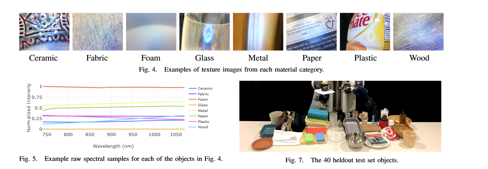
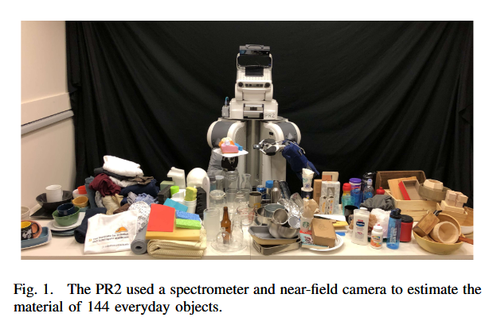
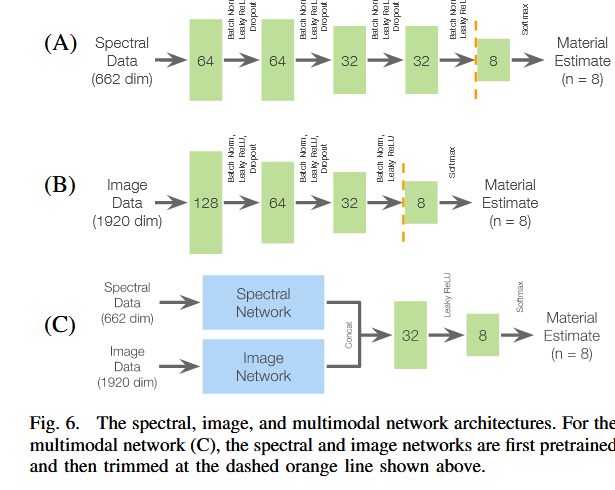
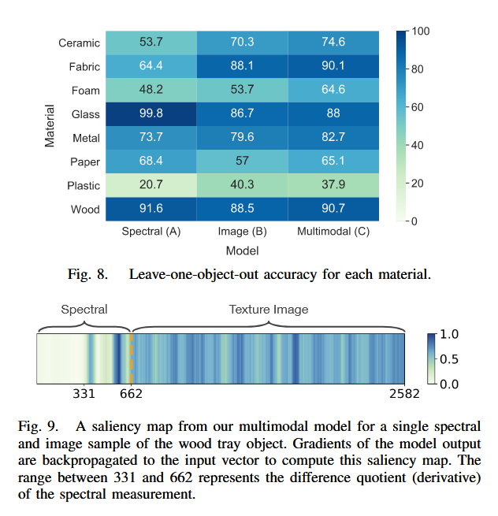

# Multimodal Material Classification for Robots

文章链接：[Multimodal Material Classification for Robots](paper.pdf)

## 摘要

这篇文章提出了一种多模态材料分类方法，该方法结合了光谱学和高分辨率纹理图片信息。并构建了一个144种家庭物品的高分辨率纹理图片以及高光谱信息的数据集。
他们证明了机器人可以通过局部的高分辨率图片以及光谱学特征进行物体分类。

## 工作原理

工作原理简单来说是将两个模态的数据分别pretrain后在进行进一步的融合，投入C网络进行分类

## 摘抄

Finally, using this spectral and visual sensing approach, we demonstrate that a robot can reliably classify a scene of
objects on a table without direct contact. In this work, we make the following contributions:

## 前序相关工作
[classification-of-household-materials-via-spectroscopy](../Classification%20of%20Household%20Materials%20via%20Spectroscopy/Classification%20of%20Household%20Materials%20via%20Spectroscopy.md)