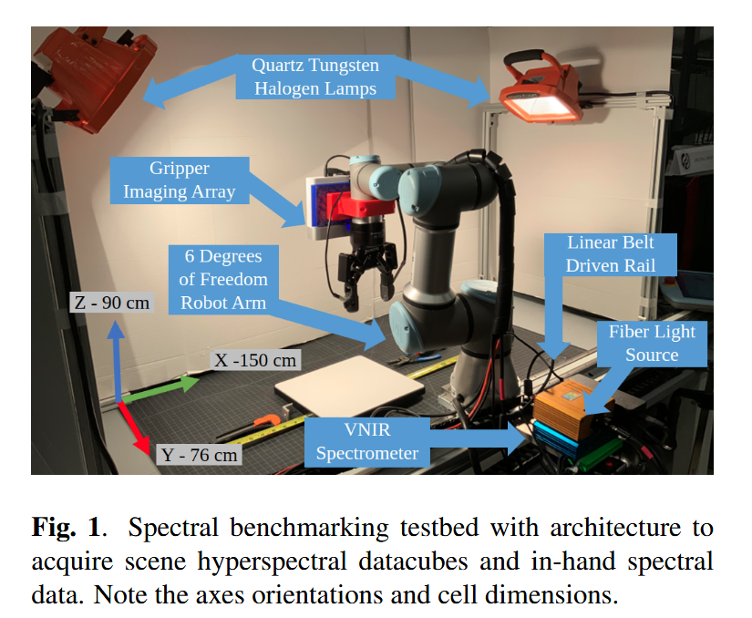

# HYPERBOT – A BENCHMARKING TESTBED FOR ACQUISITION OF ROBOT-CENTRIC HYPERSPECTRAL SCENE AND IN-HAND OBJECT DATA

2022 Workshop on Hyperspectral Image and signal Processing: Evolution in Remote Sensing, WHISPERS

## 摘要

这篇文章提出了一个新的基准测试平台，用于获取机器人中心的高光谱场景和手持物体数据。这个平台包括一个机器人系统，一个高光谱相机和一个手持式高光谱传感器。这个平台可以用于评估机器人的高光谱感知和操作能力。

机器人被平台轨道带动，线性高光谱相机被安装在执行器末端。