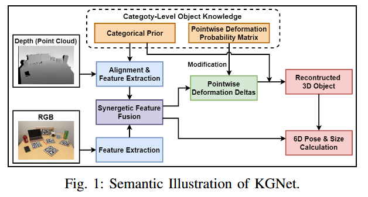
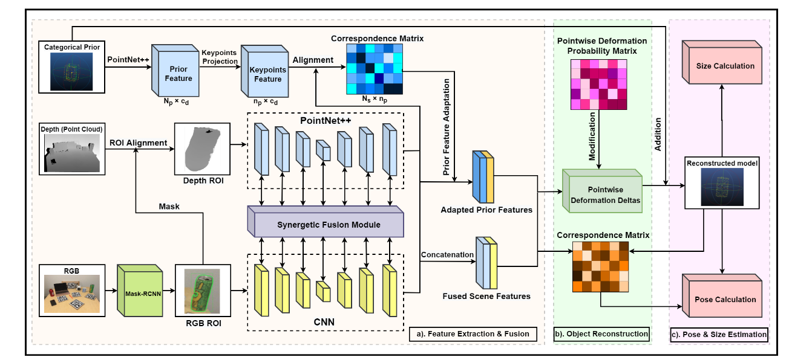

# KGNet:Knowledge-Guided Networks for Category-Level 6D Object Pose

> > Meng, Qiwei, Jason Gu, Shiqiang Zhu, Jianfeng Liao, Tianlei Jin, Fangtai Guo, Wen Wang和Wei Song. 《KGNet:
> > Knowledge-Guided Networks for Category-Level 6D Object Pose and Size Estimation》. 收入 2023 IEEE International
> > Conference on Robotics and Automation (ICRA), 6102–8. London, United Kingdom:
> > IEEE,2023. https://doi.org/10.1109/ICRA48891.2023.10160349.

文章链接: [paper.pdf](paper.pdf)

## 摘要

尽管在结构化场景下物体 6D 位姿估计和机器人抓取方面取得了巨大飞跃，但大多数方法严重依赖于目标物体事先的精确 CAD
模型，从而限制了它们的广泛应用。该网络包括三项主要创新：知识引导的分类模型生成、逐点变形概率矩阵和协同 RGBD
特征融合，前两者利用分类对象知识来重建不可见的对象，而后者则有助于姿势敏感的特征提取。

