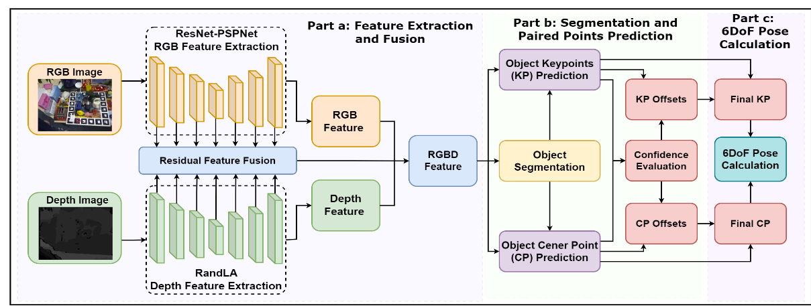
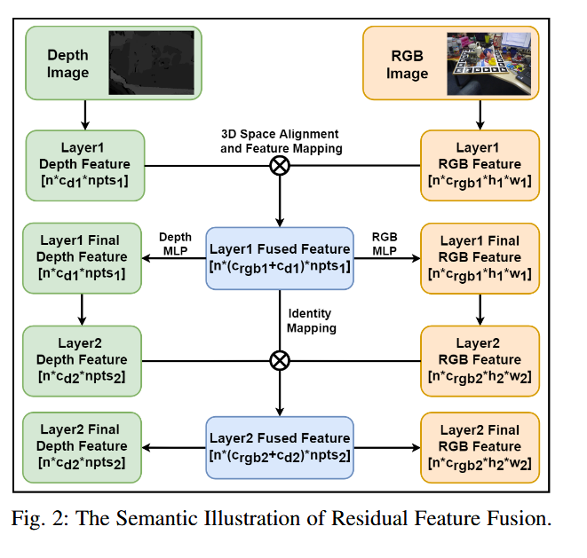

# RFFCE:Residual Feature Fusion and Confidence Evaluation Network for  6DoF Pose Estimation

> > Meng, Qiwei, Shanshan Ji, Shiqiang Zhu, Tianlei Jin, Te Li, Jason Gu和Wei Song. 《RFFCE: Residual Feature Fusion and
> > Confidence Evaluation Network for 6DoF Pose Estimation》. 收入 2023 IEEE International Conference on Robotics and
> > Automation (ICRA), 2876–83. London, United Kingdom: IEEE, 2023. https://doi.org/10.1109/ICRA48891.2023.10160448.

文章链接: [paper.pdf](paper.pdf)

## 摘要

作者提出了一个两阶段的6DoF姿态估计网络，用于在RGB-D图像中检测物体的姿态。第一阶段是一个特征融合网络，用于提取RGB-D图像的特征。
第二阶段是一个置信度评估网络，用于评估特征的置信度。作者提出了一个新的残差特征融合模块，用于融合RGB和深度图像的特征。作者还提出了一个置信度评估模块，
用于评估特征的置信度。作者在YCB-Video数据集上进行了实验，结果表明，该方法在6DoF姿态估计方面取得了最先进的性能。

