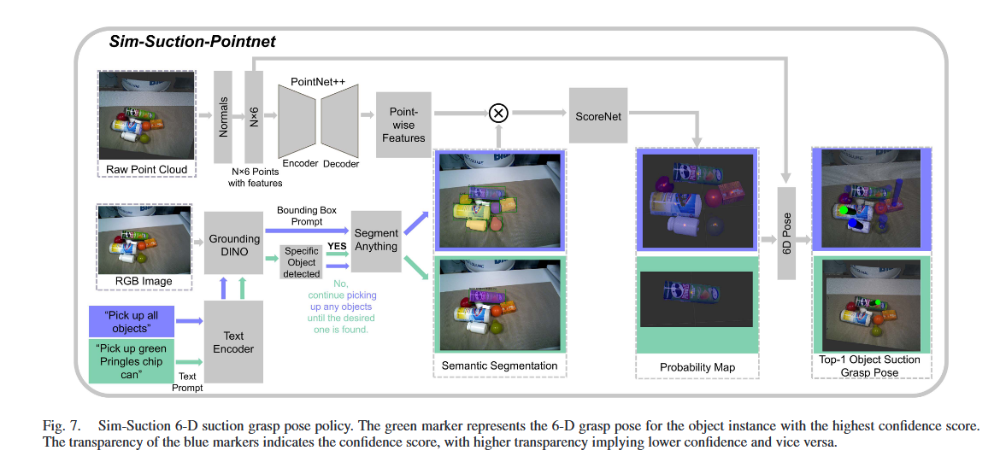
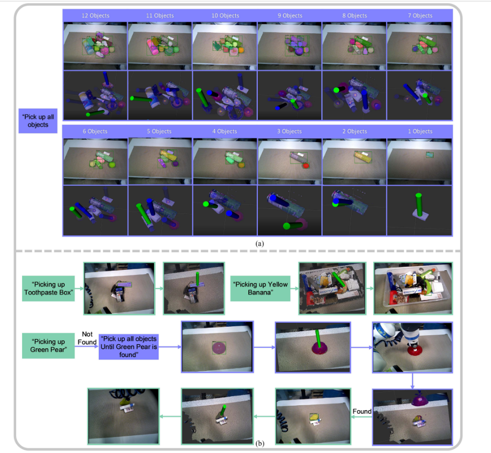

# Sim-Suction: Learning a Suction Grasp Policy for  Cluttered Environments Using a  Synthetic Benchmark

IEEE Transactions on Robotics, 2024, [文章链接](paper.pdf)

## 摘要

这篇文章为了解决在杂乱环境下的吸盘抓取问题，提出了一种新的方法。这种方法使用了对象感知的点云数据，直接生成了物体实例的6-D吸盘抓取姿势。

## 方法

点云通过PointNet产生的point-wise affordance与RGB图像产生的语义分割mask一起输入到ScoreNet网络中。ScoreNet网络生成了N*1吸力概率分布。

## 摘抄

1. THE development of autonomous mobile manipulation platforms is crucial for **the future of space habitats**, where
   robots
   can perform various tasks in cluttered environments with **minimal human intervention**.

2. identifying the grasp region and executing the mechanical grasping process
3. cluttered environments.
4. However, **to the best of authors’ knowledge**, no study on suction cup grasp success prediction uses object-aware
   point-wise affordance, which directly takes the 3-D point cloud and text prompt as input and generates robust 6-D
   suction grasp poses for object instances.
5. point-wise affordance