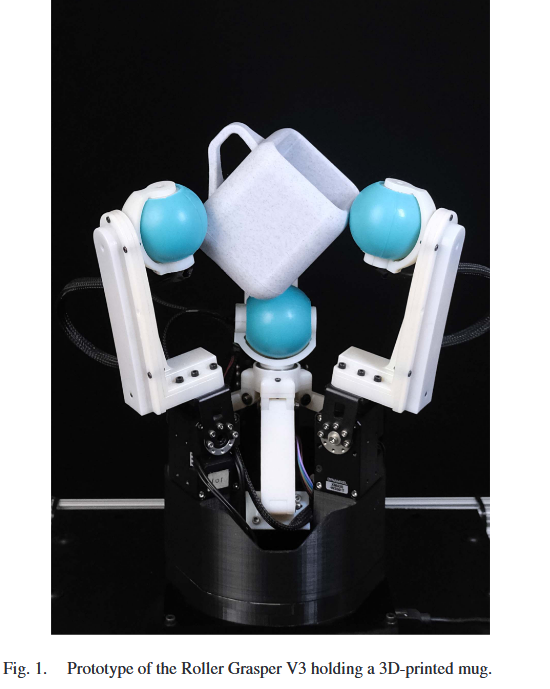
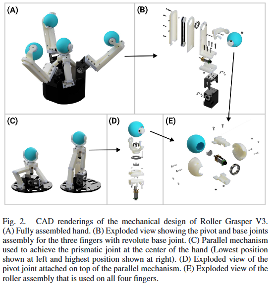
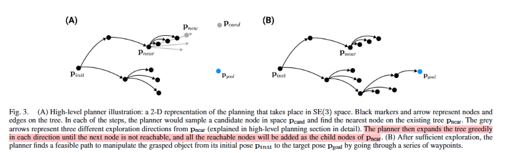
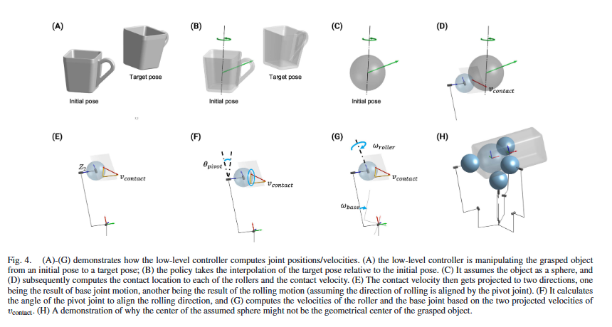
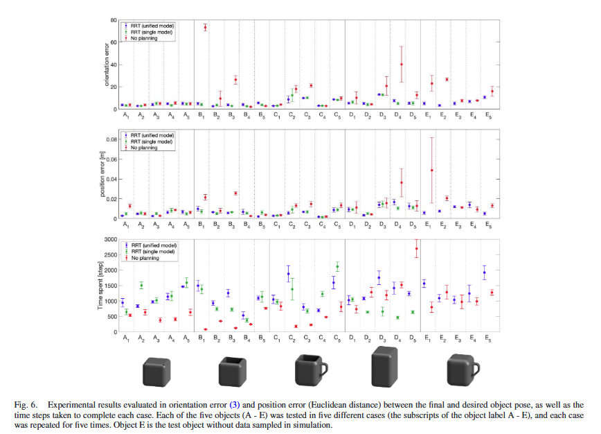

# Design and Control of Roller Grasper V3 for In-Hand Manipulation

> Yuan, Shenli, Lin Shao, Yunhai Feng, Jiatong Sun, Teng Xue, Connor L. Yako, Jeannette Bohg和J. Kenneth Salisbury.
> 《Design and Control of Roller Grasper V3 for In-Hand Manipulation》. IEEE Transactions on Robotics 40 (2024年):
> 4222–34. https://doi.org/10.1109/TRO.2024.3454388.

[论文链接](paper.pdf)

## 摘要

本文为了解决软抓取器在手持物体操作中的困难，提出了一种基于滚轮的抓取器 V3。该抓取器通过在抓取器内部集成滚轮来实现对物体的稳定抓取。
本文主要解决的问题是如何将一个物体由一个姿态转换到另一个姿态。基于此，他们提出了一种model-based和DRL混合的多层方法，利用high-level与low-level
两个控制器实现对于一些较为规则的物体的姿态的变换。

## 方法

### Grasper disign

介绍了gripper的设计细节，控制方法等。 同时强调该项设计研究的目的只是研究对于传统拟人手的替代方案而完全取代其他机械手。
他们限定了他们的研究的应用范围，但也强调了他们在实用性方面的潜力以及提高增强自动化系统效率功能的潜力。

> It is important to highlight that the objective of this research is to offer an alternative to conventional
> anthropomorphic hands, which may prove advantageous in particular scenarios. Our intention is not to propose that this
> approach should supplant other types of robotic hands entirely. Rather, we envision this work as a foundational
> contribution to the field of autonomous manipulation using rolling contact. We anticipate that the specific
> form-factor
> of the hands could be tailored to suit distinct applications, thereby broadening the scope and utility of our
> findings.
> This adaptability could potentially lead to innovations in how robotic hands are designed and utilized across various
> industries, enhancing both efficiency and functionality in automated systems.

### 和先前版本的比较

### 操控算法

分为high-level与low-level的控制器，high-level控制器通过探索初始及目标姿态之间的中间姿态来寻找稳定，即不断迭代。而low-level控制器则是通过将对象近似为球体，并尝试在其当前姿态
pa 和目标姿态 pb 之间直接操纵对象。

high-level (探索随机树（RRT）算法):

low-level:

## 实验
### 操控实验

### 抓取实验
抓取实验缺乏数据